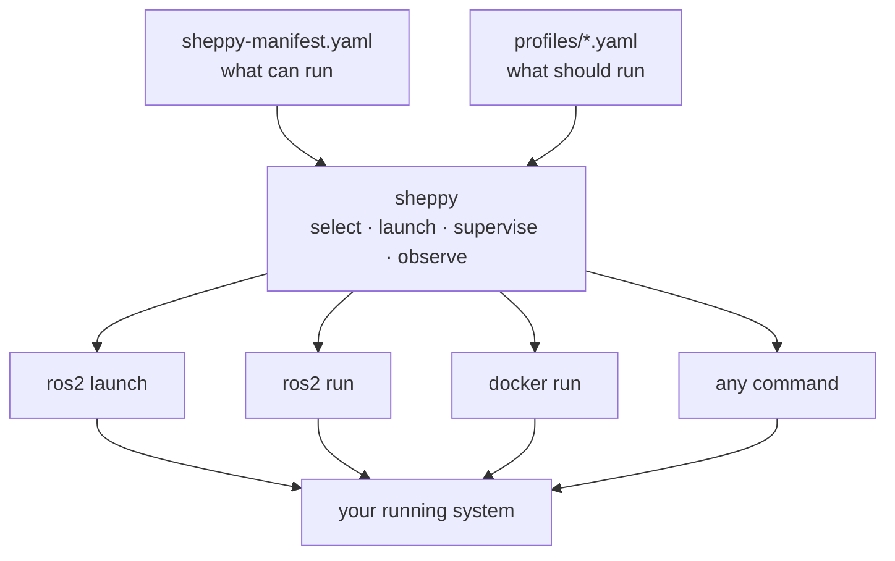

# Sheppy 🐑🐕

Herds the ROS2 nodes of a distributed robotics project — catalog them, switch
mock vs. real, launch and supervise them from one operator console.

- **Swap alternatives quickly:** mock or real driver, one planner or another,
  different camera configs.
- **Profiles instead of long launch files:** save the configuration you
  picked and bring it back with `sheppy up <profile>`.
- **A terminal UI with a persistent daemon:** bring nodes up from a TUI that
  works over SSH; a background daemon keeps them running after you close it,
  so you don't need long commands in tmux panes.
- **Node status and parameters in one place:** state, CPU and memory,
  latest output, and parameters for each node, in one TUI. Crashed nodes
  show their exit code and keep their logs.
- **Containers and non-ROS programs too:** Docker containers (inline or from
  an existing compose file) and non-ROS commands like simulator GUIs,
  supervised the same way.
- **A CLI for scripts and SSH:** `sheppy up`, `status`, `logs`, `woof`, and
  `down` work without the TUI.

**Docs: https://rammp-org.github.io/sheppy**



Sheppy calls `ros2 launch` rather than replacing it. An alternative of kind
`launch_file` shells out to `ros2 launch`; `executable` shells out to
`ros2 run`. Sheppy is the layer above: it catalogs which launch files are
interchangeable, remembers which set you picked, and supervises the processes
so they keep running after you close the terminal.

## Install

```bash
curl -LsSf https://rammp-org.github.io/sheppy/install.sh | sh
```

Then open the TUI with `sheppy` next to your `sheppy-manifest.yaml`, or follow
[Getting started](https://rammp-org.github.io/sheppy/getting-started/) for a
90-second walkthrough that needs no ROS.

## Headless

```bash
sheppy up <profile>          # converge the running system to a profile
sheppy status                # what's running
sheppy logs <node> -n 50     # tail a node's output
sheppy woof <node>           # restart it 🐕
sheppy down                  # stop everything, then the daemon
```

Flags and exit codes: [CLI reference](https://rammp-org.github.io/sheppy/cli/).

## Development

```bash
git clone git@github.com:rammp-org/sheppy.git
cd sheppy
uv sync
uv run pytest
```

User docs live in [`docs/`](docs/); design records in
[`docs/superpowers/`](docs/superpowers/).
