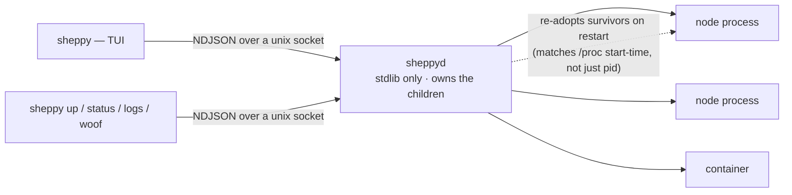

# Architecture

- **Tech:** Python + [Textual](https://textual.textualize.io/) for the TUI. `sheppyd`
  imports only the standard library.
- **The clients do the work:** the TUI and CLI read the manifest and resolve each
  alternative into a launch descriptor; `sheppyd` never sees YAML and runs exactly
  what it is sent. See the [sheppyd guide](../guides/sheppyd).
- **Daemon-backed:** `sheppyd` owns the processes, so the system survives the TUI
  detaching or crashing.
- **The manifest describes the system:** a version-controlled `sheppy-manifest.yaml`.
- **Kinds are launchers:** `executable`, `launch_file`, `process` and `docker` all
  register through the `sheppy.launchers` entry-point group, so a plugin can add
  more. See [Writing a launcher plugin](../guides/launcher-plugins).

## Roadmap

Each step ships with its own spec → plan → implementation cycle (see
[Design records](../design-records)).

| Step | Scope | Status |
|------|-------|--------|
| Manifest + catalog TUI | YAML schema for machines/nodes/alternatives; Textual app to load, validate, and browse it; select one alternative per node (mock vs. real). | ✅ Done |
| Profiles | Save/load named selection sets + declared-param overrides as per-profile YAML, managed in the TUI. | ✅ Done |
| `sheppyd` + local launch | Supervisor daemon speaking NDJSON over a unix socket; launch processes locally with live status, stop/restart. | ✅ Done |
| Launcher plugins + Docker | Kinds discovered through entry points; the `docker` kind runs containers and compose services. | ✅ Done |
| Multi-machine launch via SSH | One `sheppyd` per host; the TUI connects to each; SSH bootstraps remote daemons. Until then the `machine:` field is accepted but every launch is local. | ⬜ Planned |
| Live introspection | Graph-API only, no custom node base class: the manifest's declared `publishes`/`subscribes` is the *expected* contract, the live ROS graph (read through `rclpy`) is the *actual*. A declared subscription with zero matching publishers is flagged as starved. | ⬜ Planned |
