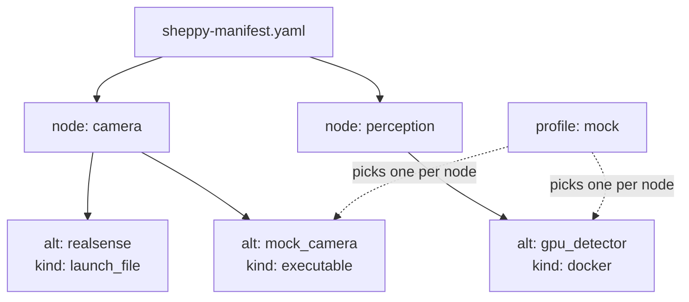
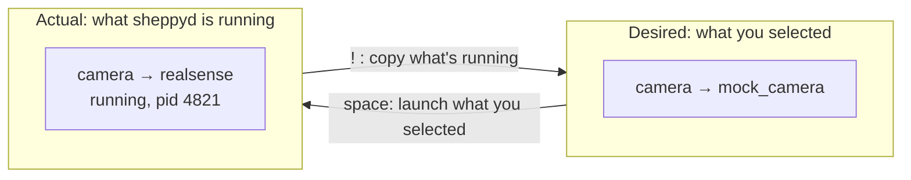
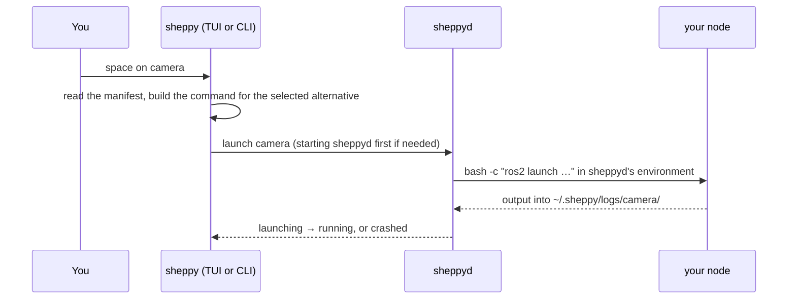

# Concepts

## A node is not a ROS node

A **node** in a sheppy manifest is a *logical unit of your system* — "the
camera", "perception", "the sim". It is not a ROS node. One sheppy node may be
a launch file that starts a dozen ROS nodes, or a container, or a bare command.

If you already have a bringup launch file, it can be a single node to start
with. Split it into several nodes when you want to swap its parts
independently — the real camera with the mock planner, say.

Where both meanings appear together, these docs say **manifest node** and
**ROS node**.

## Alternatives

Each node lists **alternatives**: interchangeable ways to do that job. The
camera might be the real RealSense driver or a mock publisher. Exactly one
alternative per node is selected at a time.

## Profiles

A **profile** is a saved selection — which alternative each node should use,
plus any parameter overrides. `profiles/mock.yaml` next to your manifest is a
profile. Profiles are how you say "bring up the whole system this way" instead
of choosing node by node.

## Desired vs actual

- **Desired** is what you asked for: the alternatives currently selected, from
  a profile or from clicking around the TUI. Open the TUI with nothing selected
  and whatever `sheppyd` is already supervising becomes the starting selection
  (see [TUI](../tui)).
- **Actual** is what `sheppyd` is running right now.

The two often differ: a node crashes, someone runs `sheppy up` from another
terminal, or you switch profiles. The TUI marks each node where they differ,
and you can bring either side in line with the other.

A `Δ` in the TUI marks a node where the two disagree, and the PROCESS tab says
[why](../tui#drift). `space` pushes desired onto actual by launching your
selection; `!` pulls actual into desired by copying whatever is already
running.

## What happens when you press `space`

- **The TUI and CLI build the command.** They read the manifest and profile
  and work out exactly what to run. `sheppyd` never reads YAML.
- **`sheppyd` owns the processes.** It's a small background daemon, one per
  user, started automatically by the first launch. Quit the TUI or
  lose your SSH session and the nodes keep running; open the TUI again and it
  reconnects.
- **Nodes inherit `sheppyd`'s environment**, which came from the terminal that
  started it. For ROS that decides what's sourced and which `ROS_DOMAIN_ID`
  nodes use — see [ROS integration](../ros-integration).

The [sheppyd guide](../guides/sheppyd) covers the daemon in depth.

## Two ways to drive sheppy

Use whichever fits the task.

| | Live launching | Converging a profile |
|---|---|---|
| How | The TUI: select an alternative, press `space` | `sheppy up <profile>` |
| Good for | Testing one node, debugging, trying an alternative | Bringing the whole system up a known way |
| Scope | One node at a time | Every node in the manifest |

`sheppy up` is idempotent: nodes already running the right thing are left
alone, missing ones start, wrong ones restart.
