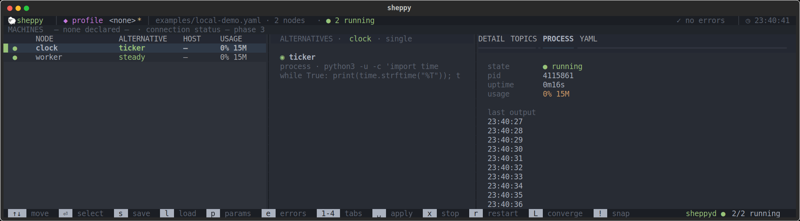
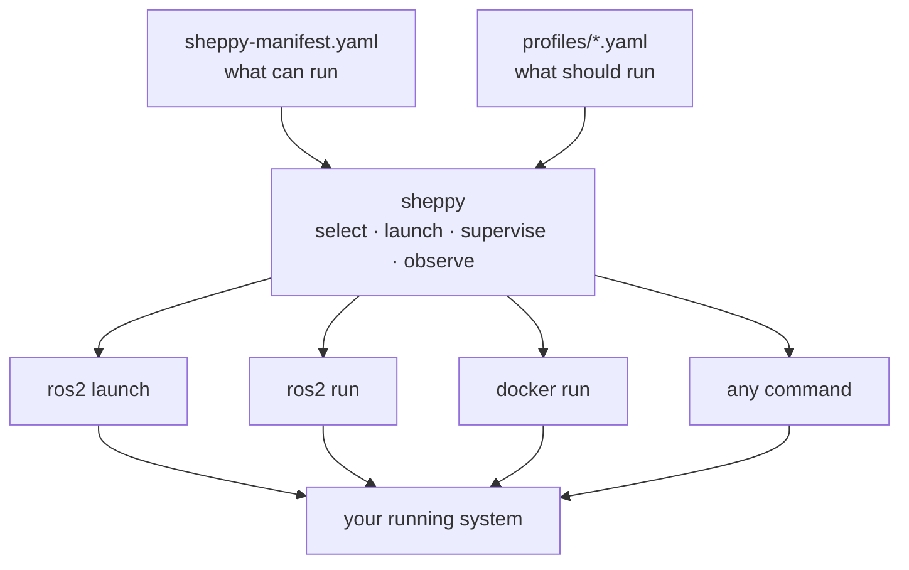

import { Cards } from 'nextra/components'

<div
  style={{
    display: 'flex',
    flexDirection: 'column',
    alignItems: 'center',
    textAlign: 'center',
    gap: '1rem',
    padding: '3.5rem 1rem 2.5rem'
  }}
>
  <h1 style={{ fontSize: '3rem', fontWeight: 800, letterSpacing: '-.03em', margin: 0 }}>
    Sheppy
  </h1>
  <p style={{ fontSize: '1.25rem', maxWidth: '38rem', margin: 0, opacity: 0.8 }}>
    Herds the ROS2 nodes of a distributed robotics project — catalog them,
    switch mock vs. real, launch and supervise them from one operator console.
  </p>
  <div style={{ display: 'flex', gap: '.75rem', marginTop: '.75rem', flexWrap: 'wrap', justifyContent: 'center' }}>
    <a
      href="./getting-started"
      style={{
        background: '#3b82f6',
        color: '#fff',
        padding: '.6rem 1.4rem',
        borderRadius: '.5rem',
        fontWeight: 600,
        textDecoration: 'none'
      }}
    >
      Get started
    </a>
    <a
      href="https://github.com/rammp-org/sheppy"
      style={{
        border: '1px solid #3b82f680',
        padding: '.6rem 1.4rem',
        borderRadius: '.5rem',
        fontWeight: 600,
        textDecoration: 'none'
      }}
    >
      GitHub
    </a>
  </div>
</div>



## Why sheppy?

1. **Swap alternatives quickly.** Each part of your system lists the
   interchangeable ways to run it: a mock or the real driver, one planner or
   another, different camera configs. Pick one in the TUI and press `space`;
   sheppy stops what that part was running and starts your choice.
2. **Profiles instead of long launch files.** Launch files that switch
   between configurations grow long and full of conditionals. In sheppy you
   pick the configuration you want, save it as a profile (a short YAML file),
   and `sheppy up <profile>` starts that configuration again.
3. **A terminal UI with a persistent daemon.** Bring nodes up and down from a
   TUI that runs in any terminal, including over SSH. A background daemon keeps
   the nodes running after you close it, so you don't need a tmux session full
   of long `ros2 launch` commands.
4. **Node status and parameters in one place.** The TUI shows each node's
   state, CPU and memory, and latest output, flags where what's running
   differs from what you selected, and lets you change a node's parameters and
   relaunch it. A crashed node is marked with its exit code and left stopped,
   and each run's output is kept in its own log file.
5. **Containers and non-ROS programs too.** Alternatives can be ROS
   executables and launch files, Docker containers (defined inline or taken
   from a compose file you already have), or any command, like a simulator
   GUI, all supervised the same way.
6. **A CLI for scripts and SSH.** `sheppy up`, `status`, `logs`, `restart`, and
   `down` work without the TUI. `sheppy up` restarts only the nodes whose
   command or parameters changed.



Sheppy calls `ros2 launch` rather than replacing it. An alternative of kind
`launch_file` shells out to `ros2 launch`; `executable` shells out to
`ros2 run`. Sheppy is the layer above: it catalogs which launch files are
interchangeable, remembers which set you picked, and supervises the
processes so they keep running after you close the terminal.

```bash
curl -LsSf https://rammp-org.github.io/sheppy/install.sh | sh
```

Four terms come up throughout these docs; [Concepts](./concepts) explains them:

- **[Node](./concepts#a-node-is-not-a-ros-node)** — a logical unit of your system, not a ROS node.
- **[Alternative](./concepts#alternatives)** — one of the interchangeable ways to run a node (mock vs. real).
- **[Profile](./concepts#profiles)** — a saved selection of alternatives for the whole system.
- **[Daemon](./concepts#what-happens-when-you-press-space)** — `sheppyd`, which launches and supervises processes.

## Where to go next

<Cards>
  <Cards.Card title="Getting started" href="./getting-started" arrow />
  <Cards.Card title="TUI" href="./tui" arrow />
  <Cards.Card title="Manifest" href="./manifest" arrow />
  <Cards.Card title="CLI reference" href="./cli" arrow />
  <Cards.Card title="sheppyd — the launch supervisor" href="./guides/sheppyd" arrow />
  <Cards.Card title="Writing a launcher plugin" href="./guides/launcher-plugins" arrow />
</Cards>

## What works today

Load a manifest, pick one alternative (mock vs. real) per node, save those
picks with their parameter overrides as **profiles**, and launch and supervise
the nodes with `sheppyd`. They keep running after the TUI closes.

Not yet: launching on a second machine, restarting crashed nodes
automatically, starting nodes in dependency order, or checking declared topics
against the live ROS graph. See the [roadmap](./architecture#roadmap).

Sheppy is built around ROS 2, but `process` and `docker` alternatives don't
need ROS.
