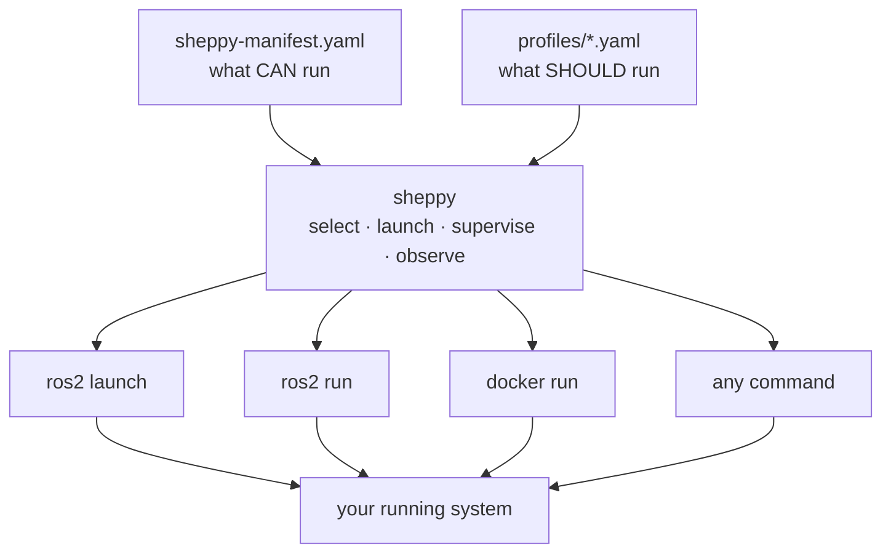

import { Cards } from 'nextra/components'
import Link from 'next/link'
import { CrookIcon } from '../components/logo'

<div
  style={{
    display: 'flex',
    flexDirection: 'column',
    alignItems: 'center',
    textAlign: 'center',
    gap: '1rem',
    padding: '3.5rem 1rem 2.5rem'
  }}
>
  <div style={{ color: '#3b82f6' }}>
    <CrookIcon size={64} />
  </div>
  <h1 style={{ fontSize: '3rem', fontWeight: 800, letterSpacing: '-.03em', margin: 0 }}>
    Sheppy
  </h1>
  <p style={{ fontSize: '1.25rem', maxWidth: '38rem', margin: 0, opacity: 0.8 }}>
    Herds the ROS2 nodes of a distributed robotics project — catalog them,
    switch mock vs. real, launch and supervise them from one operator console.
  </p>
  <div style={{ display: 'flex', gap: '.75rem', marginTop: '.75rem', flexWrap: 'wrap', justifyContent: 'center' }}>
    <Link
      href="/getting-started"
      style={{
        background: '#3b82f6',
        color: '#fff',
        padding: '.6rem 1.4rem',
        borderRadius: '.5rem',
        fontWeight: 600,
        textDecoration: 'none'
      }}
    >
      Get started
    </Link>
    <a
      href="https://github.com/rammp-org/sheppy"
      style={{
        border: '1px solid #3b82f680',
        padding: '.6rem 1.4rem',
        borderRadius: '.5rem',
        fontWeight: 600,
        textDecoration: 'none'
      }}
    >
      GitHub
    </a>
  </div>
</div>

## Why Sheppy?



Sheppy does not replace `ros2 launch` — it calls it. An alternative of kind
`launch_file` shells out to `ros2 launch`; `executable` shells out to
`ros2 run`. Sheppy is the layer above: it catalogs which launch files are
interchangeable, remembers which set you picked, and supervises the
processes so they outlive your terminal.

```bash
curl -LsSf https://rammp-org.github.io/sheppy/install.sh | sh
```

Four words carry the rest — see [Concepts](/concepts) for the full picture:

- **[Node](/concepts#a-node-is-not-a-ros-node)** — a logical unit of your system, not a ROS node.
- **[Alternative](/concepts#alternatives)** — one of the interchangeable ways to run a node (mock vs. real).
- **[Profile](/concepts#profiles)** — a saved selection of alternatives for the whole system.
- **[Daemon](/concepts#desired-vs-actual)** — `sheppyd`, which actually launches and supervises processes.

## Where to go next

<Cards>
  <Cards.Card title="Getting started" href="/getting-started" arrow />
  <Cards.Card title="The TUI" href="/tui" arrow />
  <Cards.Card title="The manifest" href="/manifest" arrow />
  <Cards.Card title="CLI reference" href="/cli" arrow />
  <Cards.Card title="sheppyd — the launch supervisor" href="/guides/sheppyd" arrow />
  <Cards.Card title="Writing a launcher plugin" href="/guides/launcher-plugins" arrow />
</Cards>

## What works today

Load a manifest, browse nodes and their alternatives, and select one
alternative (mock vs. real) per node (Phase 1). Save and load those choices —
plus per-alternative parameter overrides — as named **profiles** (Phase 2a).
Phase 2b adds `sheppyd`: select, press `space`, and the process is really
running — locally, surviving TUI detach. Multi-machine launch (Phase 3) and
live graph introspection (Phase 4) are planned; see the
[roadmap](/architecture#project-phases).
