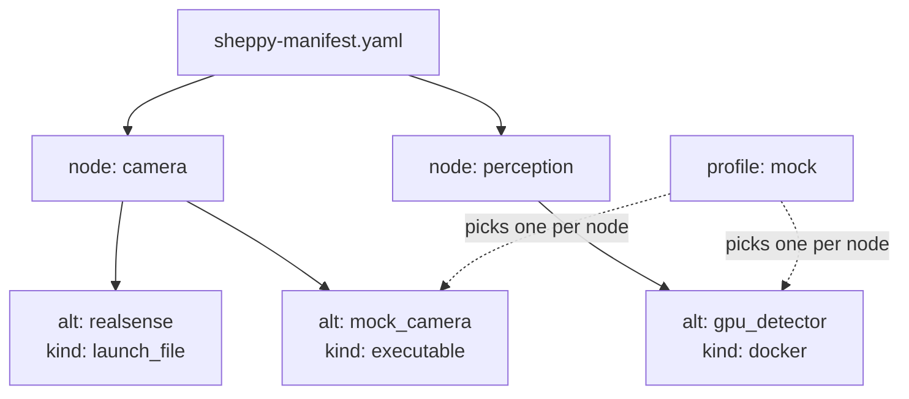

import { Callout } from 'nextra/components'

# Manifest

The manifest, `sheppy-manifest.yaml`, describes your machines, nodes, and
their alternatives. Keep it in version control. Both the TUI and the CLI read it; [`sheppyd`](../guides/sheppyd)
never does.

This page teaches manifest authoring by walking
[`examples/sheppy-manifest.yaml`](https://github.com/rammp-org/sheppy/tree/main/examples/sheppy-manifest.yaml)
top to bottom. It uses all four launch kinds and opens in the TUI on any
machine, but its nodes only launch where the ROS packages, container image,
and simulator it names are installed. Open it yourself:

```
sheppy examples/sheppy-manifest.yaml
```

For [node](../concepts), alternative, and profile vocabulary, see
[Concepts](../concepts) first — this page assumes it.

## Manifest anatomy



## Machines

```yaml
machines:
  - name: robot
    host: 10.0.0.20
    user: researcher
    # Sourced before the command of any alternative that sets machine: robot.
    ros_setup: /opt/ros/humble/setup.bash
  - name: workstation
    host: 10.0.0.5
    user: researcher
```

<Callout type="warning">
**Multi-machine launch isn't ready yet.** Every node runs on the machine where
you run sheppy, whatever its `machine:` says. Launching on other hosts is
planned; see the [roadmap](../architecture#roadmap).
</Callout>

The block is optional. `name`, `host`, and `user` are all required, but today
only `ros_setup` has an effect: an alternative that sets `machine: <name>` gets
that machine's `ros_setup` sourced before its command runs. The TUI also shows
`machine:` on each alternative as a label.

## Nodes and alternatives

A node is one job in your system; its `alternatives` are interchangeable
ways to do that job. Here the `camera` node has two — a real RealSense
driver and a mock:

```yaml
nodes:
  # Each node is one job in your system, with interchangeable ways to do it.
  - name: camera
    description: "RGB-D source"          # optional free text; stored but not displayed today
    select: single                       # optional; 'single' is the only value
    alternatives:
      # kind: launch_file -> ros2 launch <package> <launch_file>
      - id: realsense
        kind: launch_file
        package: realsense2_camera
        launch_file: rs_launch.py
        machine: robot
        params:                          # passed as name:=value
          depth_module.profile: 848x480x30
        publishes: [/camera/color/image_raw, /camera/depth/points]

      # kind: executable -> ros2 run <package> <executable>
      - id: mock_camera
        kind: executable
        package: our_mocks
        executable: mock_camera
        machine: workstation
        params:                          # passed as --ros-args -p name:=value
          frame_rate: 30
        publishes: [/camera/color/image_raw]
```

Each alternative's `kind` says how sheppy launches it. Both of these also
declare `publishes` — see [below](#publishessubscribes-are-documentation-not-verification)
for what that does.

## Launch kinds

Sheppy ships four kinds, and a [launcher plugin](../guides/launcher-plugins)
can add more. The [manifest reference](../manifest-reference#kinds) lists
every field each one takes.

### `launch_file`

Runs `ros2 launch <package> <launch_file>`, like `realsense` above. Its
`params` become launch arguments (`name:=value`), so the launch file must
declare them.

### `executable`

Runs `ros2 run <package> <executable>`, like `mock_camera` above. Its
`params` become node parameters (`--ros-args -p name:=value`).

Before pointing either of these at a real workspace, read
[ROS integration](../ros-integration): nodes get their ROS environment from
the terminal that starts `sheppyd`, not from the manifest.

### `docker`

Runs a container named `sheppy-<node>`. It comes from the docker launcher
plugin, which is installed with sheppy. Give it exactly one of an inline
`container:` or a `compose:` reference to a service in an existing compose
file:

```yaml
  - name: perception
    description: "Detector, shipped as a container"
    alternatives:
      # kind: docker -> a container supervised like any other process.
      # Provided by the docker launcher plugin, not the core.
      # Give exactly one of 'container' (inline) or 'compose' (a service
      # from an existing compose file).
      - id: gpu_detector
        kind: docker
        machine: workstation
        subscribes: [/camera/color/image_raw]
        publishes: [/detections]
        container:
          image: ghcr.io/rammp-org/detector:latest
          network_mode: host
          command: ["--model", "yolo"]
```

The container doesn't inherit `sheppyd`'s environment, so set `ROS_DOMAIN_ID`
and anything else it needs under `environment:` (see
[ROS integration](../ros-integration#containers)).

### `process`

Runs `command` as-is under `bash -c` — for anything that isn't a ROS package
executable or launch file, like a simulator GUI or `ros2 bag record`.
`params` are ignored for this kind, and sheppy warns if you set them:

```yaml
  - name: sim_gui
    description: "Anything that is just a command"
    alternatives:
      # kind: process -> the command, run as-is. NOTE: 'params' is ignored
      # for this kind and sheppy will warn if you set it.
      - id: unreal
        kind: process
        command: "/opt/sim/UnrealEditor MyProject -game"
        machine: workstation
```

## publishes/subscribes are documentation, not verification

The manifest's declared `publishes`/`subscribes` describe the *expected*
contract; sheppy does not yet compare it against the live ROS graph to
flag starved subscriptions. That comparison is on the
[roadmap](../architecture#roadmap).

## Full field reference

For the complete field-by-field tables — every field, whether it's
required, and its type — see the [manifest reference](../manifest-reference).

## Other examples

The repository ships several manifests under
[`examples/`](https://github.com/rammp-org/sheppy/tree/main/examples):

| File | What it shows |
|------|---------------|
| `sheppy-manifest.yaml` | The annotated reference, walked above |
| `local-demo.yaml` | Plain processes — try Sheppy without ROS installed |
| `docker-demo.yaml` | The `docker` launch kind |
| `cockpit-demo.yaml` | Exercises the cockpit layout |
