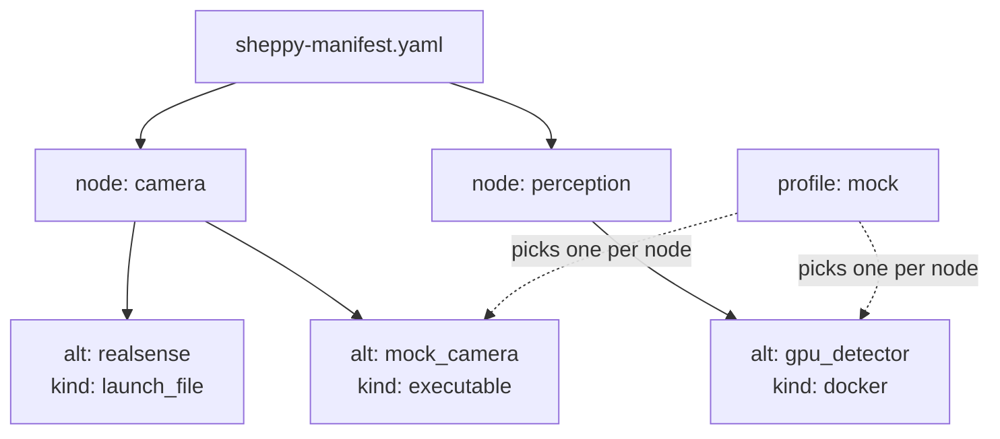

# The manifest

The **manifest is the source of truth**: a curated, version-controlled
`sheppy-manifest.yaml` describing your machines, nodes, and their
alternatives. Both the TUI and the CLI read it; [`sheppyd`](../guides/sheppyd)
never does.

This page teaches manifest authoring by walking
[`examples/sheppy-manifest.yaml`](https://github.com/rammp-org/sheppy/tree/main/examples/sheppy-manifest.yaml)
top to bottom — a complete, runnable file covering every field and all four
launcher kinds. Open it yourself:

```
sheppy examples/sheppy-manifest.yaml
```

For [node](../concepts), alternative, and profile vocabulary, see
[Concepts](../concepts) first — this page assumes it.

## Manifest anatomy



## Machines

Optional — omit the block entirely to run everything locally.

```yaml
machines:
  - name: robot
    host: 10.0.0.20
    user: researcher
    # Sourced before every command that runs on this machine.
    ros_setup: /opt/ros/humble/setup.bash
  - name: workstation
    host: 10.0.0.5
    user: researcher
```

`name`, `host`, and `user` are all required. A machine only does one thing
today: an alternative that sets `machine: <name>` has that machine's
`ros_setup` sourced before its command runs. It is *not* remote launching —
`sheppyd` runs locally, and launching on another host is not yet
implemented. The TUI does show `machine:` on each alternative, but only as
a label.

## Nodes and alternatives

A node is one job in your system; its `alternatives` are interchangeable
ways to do that job. Here the `camera` node has two — a real RealSense
driver and a mock — showing two of the four launcher kinds:

```yaml
nodes:
  # Each node is one job in your system, with interchangeable ways to do it.
  - name: camera
    description: "RGB-D source"          # optional free text; stored but not displayed today
    select: single                       # optional; 'single' is the only value
    alternatives:
      # kind: launch_file -> ros2 launch <package> <launch_file>
      - id: realsense
        kind: launch_file
        package: realsense2_camera
        launch_file: rs_launch.py
        machine: robot
        params:                          # passed as name:=value
          depth_module.profile: 848x480x30
        publishes: [/camera/color/image_raw, /camera/depth/points]

      # kind: executable -> ros2 run <package> <executable>
      - id: mock_camera
        kind: executable
        package: our_mocks
        executable: mock_camera
        machine: workstation
        params:                          # passed as --ros-args -p name:=value
          frame_rate: 30
        publishes: [/camera/color/image_raw]
```

`kind: launch_file` runs `ros2 launch <package> <launch_file>`;
`kind: executable` runs `ros2 run <package> <executable>`. Both take
`params`, passed differently per kind as the comments above show, plus
`publishes`/`subscribes` — see below for what those actually do.

## publishes/subscribes are documentation, not verification

The manifest's declared `publishes`/`subscribes` describe the *expected*
contract; sheppy does not yet compare it against the live ROS graph to
flag starved subscriptions. That comparison is on the
[roadmap](../architecture#project-phases).

## The other two kinds

`kind: docker` is provided by the docker launcher plugin, not the core —
give it exactly one of an inline `container:` or a `compose:` reference to
an existing compose file:

```yaml
  - name: perception
    description: "Detector, shipped as a container"
    alternatives:
      # kind: docker -> a container supervised like any other process.
      # Provided by the docker launcher plugin, not the core.
      # Give exactly one of 'container' (inline) or 'compose' (a service
      # from an existing compose file).
      - id: gpu_detector
        kind: docker
        machine: workstation
        subscribes: [/camera/color/image_raw]
        publishes: [/detections]
        container:
          image: ghcr.io/rammp-org/detector:latest
          network_mode: host
          command: ["--model", "yolo"]
```

`kind: process` runs the given command as-is — useful for anything that
isn't a ROS process, like a simulator GUI. `params` are ignored for this
kind, and sheppy warns if you set them:

```yaml
  - name: sim_gui
    description: "Anything that is just a command"
    alternatives:
      # kind: process -> the command, run as-is. NOTE: 'params' is ignored
      # for this kind and sheppy will warn if you set it.
      - id: unreal
        kind: process
        command: "/opt/sim/UnrealEditor MyProject -game"
        machine: workstation
```

A launcher plugin can add further kinds; see
[Launcher plugins](../guides/launcher-plugins).

## Full field reference

For the complete field-by-field tables — every field, whether it's
required, and its type — see the [manifest reference](../manifest-reference).

## Other examples

The repository ships several manifests under
[`examples/`](https://github.com/rammp-org/sheppy/tree/main/examples):

| File | What it shows |
|------|---------------|
| `sheppy-manifest.yaml` | The annotated reference, walked above |
| `local-demo.yaml` | Plain processes — try Sheppy without ROS installed |
| `docker-demo.yaml` | The `docker` launch kind |
| `cockpit-demo.yaml` | Exercises the cockpit layout |
