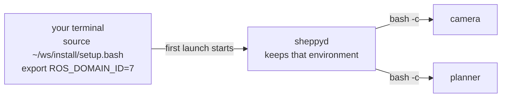

# ROS integration

What sheppy does with your ROS environment, and what it leaves to you. Read
this before pointing sheppy at a real workspace.

## Where your nodes get their environment

Every node is started by `sheppyd`, and `sheppyd` gives each one a copy of
**its own environment**, which it inherited from the terminal that started it.
Sheppy does not source ROS for you unless you ask it to with
[`ros_setup`](#sourcing-per-alternative-with-ros_setup).



What that means in practice:

- **Source ROS before the first launch.** `sheppyd` starts the first time you
  press `space` in the TUI or run `sheppy up`. Whatever that terminal had
  sourced and exported — the ROS distro, your workspace overlay,
  `ROS_DOMAIN_ID`, `RMW_IMPLEMENTATION` — is what every node gets.
- **`~/.bashrc` is not read.** Nodes run under a non-interactive `bash -c`. A
  `source` line in `~/.bashrc` only counts if it was already in effect in the
  terminal that started `sheppyd`.
- **Later changes to your shell don't reach `sheppyd`.** Re-sourcing, or exporting a
  different `ROS_DOMAIN_ID` in another terminal, doesn't reach a `sheppyd`
  that is already running. To switch, stop everything and bring it back up
  from a terminal that has the new environment:

  ```bash
  sheppy down                         # stop every node, then sheppyd
  source ~/ws/install/setup.bash
  export ROS_DOMAIN_ID=7
  sheppy up mock                      # sheppyd starts again with this environment
  ```

  `sheppy daemon stop` isn't enough: it stops only the daemon, the nodes keep
  the environment they started with, and `sheppy up` leaves them running
  because their command hasn't changed.
- **The working directory comes along too.** Nodes start in the directory
  `sheppyd` was started from, so a relative path in a command (for example
  `ros2 bag record -o run1`) lands there. Use absolute paths.

`sheppy daemon status` tells you whether a daemon is already running, and so
whether your current terminal's environment will be used at all.

## Sourcing per alternative with `ros_setup`

A machine can name a setup file that sheppy sources before each command that
targets it:

```yaml
machines:
  - name: workstation
    host: localhost
    user: me
    ros_setup: /home/me/ws/install/setup.bash

nodes:
  - name: planner
    alternatives:
      - id: default
        kind: executable
        package: my_planner
        executable: planner_node
        machine: workstation        # without this line, ros_setup is not sourced
```

- It applies only to alternatives that set `machine:`. There is no default
  machine.
- `~` is expanded to your home directory, so `~/ws/install/setup.bash`
  works.
- A relative path is resolved against the manifest's directory, so
  `ros_setup: install/setup.bash` in a manifest at the root of your workspace
  sources that workspace's overlay wherever `sheppyd` was started from.
- Point it at your overlay's `install/setup.bash`; colcon's setup script also
  sources the underlay the workspace was built against.
- It applies to `executable`, `launch_file`, and `process` alternatives, and
  not to `docker`.
- It is sourced on top of `sheppyd`'s environment, so `ROS_DOMAIN_ID` and your
  other exports still come from the terminal that started `sheppyd`.

## How params reach ROS

Each alternative can list `params`. How they are passed depends on the kind:

| `kind` | Manifest | What runs |
|--------|----------|-----------|
| `executable` | `params: {frame_rate: 30}` | `ros2 run <package> <executable> --ros-args -p frame_rate:=30` — node parameters |
| `launch_file` | `params: {use_sim: true}` | `ros2 launch <package> <launch_file> use_sim:=true` — **launch arguments**, so the launch file must declare them |
| `docker` | `params: {rate: 5}` | a params file mounted into the container and passed as `--ros-args --params-file` (see [the reference](../manifest-reference#docker-plugin)) |
| `process` | — | params are ignored, with a warning |

The params an alternative lists are also the only ones you can override, from
the TUI (`p`) or in a [profile](../profiles).

## What sheppy watches

Sheppy supervises the process it started — `ros2 launch`, `ros2 run`, the
container, or your command — not the ROS nodes inside it. If one node in a
launch file dies and `ros2 launch` keeps running, sheppy still shows
`● running`. Check the node's output with `sheppy logs <node>`, or have the
launch file shut down when that node exits, so sheppy sees the launch exit and
marks the node crashed:

```python
from launch.actions import Shutdown
from launch_ros.actions import Node

Node(package='my_planner', executable='planner_node', on_exit=Shutdown())
```

Stopping goes the other way: sheppy signals the whole process group, so every
ROS node the launch file started gets `SIGINT`.

## Containers

A `docker` alternative runs a container named `sheppy-<node>`. The container
does **not** inherit `sheppyd`'s environment, so set what ROS needs
explicitly:

```yaml
container:
  image: ghcr.io/lab/detector:1.2
  network_mode: host              # so DDS discovery reaches nodes on the host
  environment:
    ROS_DOMAIN_ID: "7"
    RMW_IMPLEMENTATION: rmw_cyclonedds_cpp
```

Relative host paths in `volumes` (`./maps:/maps`, `~/bags:/bags`) and
`env_file` are resolved against the manifest's directory for an inline
`container`, and against the compose file's directory for a `compose:`
service, as compose does. A `compose:` file path is resolved relative to the
manifest.

## After you rebuild or edit

| You changed | Then | Why |
|-------------|------|-----|
| Rebuilt a package (`colcon build`) | `r` in the TUI, or `sheppy restart <node>` | a restart reruns the same command, which picks up the new build |
| A param, with `p` in the TUI | `space` | `space` builds the command again with the new value |
| The manifest | quit and reopen the TUI, then `space`; or `sheppy up <profile>` | the TUI reads the manifest only when it opens, and `r` and `restart` rerun the command stored at launch |
| Your shell environment | `sheppy down`, then launch from the new shell | see [above](#where-your-nodes-get-their-environment) |

## Topics

`publishes` and `subscribes` in the manifest are documentation. The TUI's
TOPICS tab lists them, but sheppy doesn't read the ROS graph, so nothing checks
them against what is on the wire. Use `ros2 topic info -v` for that.

## One machine only

Sheppy runs every node on the machine where `sheppyd` runs. Launching on a
second host — a robot plus a workstation, say — is not supported yet.
`machine:` chooses which `ros_setup` to source and labels the node in the TUI;
it never starts anything remotely. Remote launch is on the
[roadmap](../architecture#roadmap).
