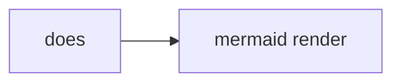
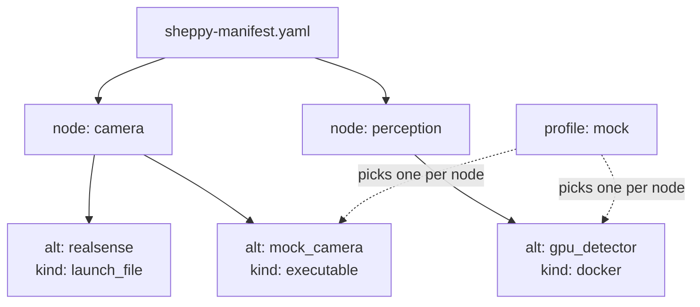
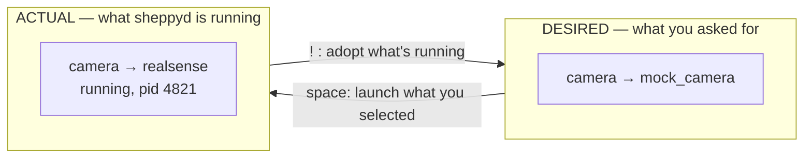
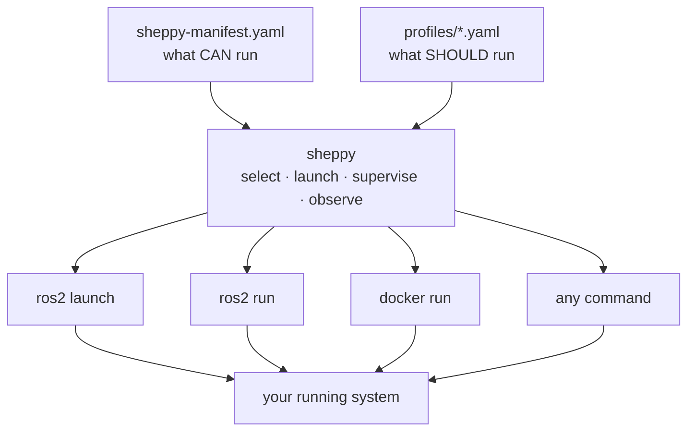
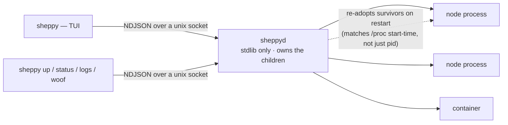

# Sheppy Docs Overhaul Implementation Plan

> **For agentic workers:** REQUIRED SUB-SKILL: Use superpowers:subagent-driven-development (recommended) or superpowers:executing-plans to implement this plan task-by-task. Steps use checkbox (`- [ ]`) syntax for tracking.

**Goal:** Close the gaps in issue #5 so a ROS-literate newcomer can understand what sheppy is, run it, and write their own manifest without reading source — and rename the manifest file to `sheppy-manifest.yaml`.

**Architecture:** Two pull requests. PR 1 is a mechanical rename (CLI defaults, installer, example file, tests). PR 2 restructures the docs so each page has one job, moves the mental model out of a deep guide onto its own page, and replaces narrated structure with four Mermaid diagrams shared between the site and the README.

**Tech Stack:** Python 3.10+ (stdlib + textual + pyyaml), pytest, uv. Docs are Nextra 4 / MDX on Next 16, built with npm. Mermaid renders via `@theguild/remark-mermaid`, already bundled with Nextra — no new dependency.

**Spec:** `docs/superpowers/specs/2026-08-19-docs-overhaul-design.md`

## Global Constraints

- Manifest filename is **`sheppy-manifest.yaml`** everywhere. Never `manifest.yaml`, never `system.yaml`, never `.spy`.
- Enforcement is **convention + escape hatch**: a bare `sheppy` finds `./sheppy-manifest.yaml`; an explicit path must keep loading any filename. Do not add filename validation.
- Diagrams are **Mermaid** in fenced ```mermaid blocks. No SVG, no ASCII art, no new npm packages.
- Invocation style in all docs is bare **`sheppy ...`**, not `uv run sheppy ...` — the installer puts it on PATH.
- A manifest **node** is a logical unit, not a ROS node. Where both appear, say "manifest node" and "ROS node".
- Prose length is **directional, not a gate**. Baseline is 1174 lines across `README.md` + `website/content/`. Removing duplicated explanation is the goal; new material may exceed the baseline. Never pad or truncate to hit a number.
- `main` is protected: every change lands via PR with `test (3.10)` and `test (3.13)` green. Never push to `main`.
- Do not include `claude.ai/code/session_...` links in any PR, issue, or commit message.
- Out-of-scope items get **filed as issues**, never fixed here.

## Schema Reference (verified against source — use these exact facts)

Read from `sheppy/manifest/models.py` and `sheppy/manifest/loader.py`:

| Level | Field | Required | Notes |
|---|---|---|---|
| `machines[]` | `name`, `host`, `user` | all three | loader errors if any is missing/empty |
| `machines[]` | `ros_setup` | no | sourced before the command when an alternative targets this machine |
| `nodes[]` | `name` | yes | must be unique |
| `nodes[]` | `alternatives` | yes | must be a non-empty list |
| `nodes[]` | `description` | no | defaults to `""` |
| `nodes[]` | `select` | no | must be `single` — any other value is an error |
| `alternatives[]` | `id` | yes | unique within the node |
| `alternatives[]` | `kind` | yes | must be a registered kind |
| `alternatives[]` | `machine` | no | must name a declared machine |
| `alternatives[]` | `params`, `publishes`, `subscribes` | no | `publishes`/`subscribes` are documentation-only today |

Per-kind required fields (from `sheppy/launch/builtins.py` and `sheppy/launch/docker/__init__.py`):

| Kind | Source | Requires | Params behaviour |
|---|---|---|---|
| `executable` | builtin | `package`, `executable` | appended as `--ros-args -p k:=v` |
| `launch_file` | builtin | `package`, `launch_file` | appended as `k:=v` |
| `process` | builtin | `command` | **ignored**, emits a warning |
| `docker` | plugin (`sheppy.launch.docker`) | exactly one of `compose` (needs `file` + `service`) or `container` | written to a params file when `ros_node_name` is set |

All four are registered through the `sheppy.launchers` entry-point group in `pyproject.toml`. Three are builtins; `docker` ships as a separate plugin module. The docs must make that distinction visible.

## File Structure

**PR 1 — rename**
- Modify: `sheppy/cli.py` — add `DEFAULT_MANIFEST`, extract `_build_parser()`, use the constant in both default sites
- Rename: `examples/system.yaml` → `examples/sheppy-manifest.yaml`, rewritten as the annotated reference
- Modify: `install.sh:45` — closing message
- Modify: `tests/test_cli.py` — new default tests
- Create: `tests/manifest/test_examples.py` — asserts the shipped example loads clean

**PR 2 — docs**
- Create: `website/content/concepts.mdx` — the mental model
- Create: `website/content/manifest-reference.mdx` — field tables
- Modify: `website/content/index.mdx`, `getting-started.mdx`, `manifest.mdx`, `tui.mdx`, `architecture.mdx`, `_meta.js`
- Modify: `website/content/guides/sheppyd.mdx`, `guides/launcher-plugins.mdx`
- Modify: `README.md` (trim to a front door), `docs/index.md` (dedupe)

---

# PR 1 — Manifest rename

Branch from `main` as `feat/manifest-rename`. This PR must be mergeable on its own.

### Task 1: CLI defaults to `sheppy-manifest.yaml`

**Files:**
- Modify: `sheppy/cli.py:16` (`build_app` default), `sheppy/cli.py:37` (`--manifest` default)
- Test: `tests/test_cli.py`

**Interfaces:**
- Produces: `sheppy.cli.DEFAULT_MANIFEST` (str) and `sheppy.cli._build_parser() -> argparse.ArgumentParser`, both used by Task 3's doc sweep and by later tests.

- [ ] **Step 1: Write the failing tests**

Append to `tests/test_cli.py`:

```python
def test_build_app_defaults_to_sheppy_manifest(tmp_path, monkeypatch):
    (tmp_path / "sheppy-manifest.yaml").write_text("machines: []\nnodes: []\n")
    monkeypatch.chdir(tmp_path)

    app = build_app([])

    assert app.path == "sheppy-manifest.yaml"
    assert app.manifest is not None


def test_explicit_path_still_loads_any_filename(tmp_path):
    p = tmp_path / "legacy-system.yaml"
    p.write_text("machines: []\nnodes: []\n")

    app = build_app([str(p)])

    assert app.manifest is not None, "escape hatch must keep working"


def test_up_manifest_flag_defaults_to_sheppy_manifest():
    from sheppy.cli import _build_parser

    args = _build_parser().parse_args(["up", "some-profile"])

    assert args.manifest == "sheppy-manifest.yaml"
```

- [ ] **Step 2: Run the tests to verify they fail**

Run: `uv run pytest tests/test_cli.py -q`
Expected: FAIL — `test_build_app_defaults_to_sheppy_manifest` asserts `app.path == "sheppy-manifest.yaml"` but gets `"system.yaml"`; `test_up_manifest_flag_defaults_to_sheppy_manifest` fails with `ImportError: cannot import name '_build_parser'`.

- [ ] **Step 3: Add the constant and use it in `build_app`**

In `sheppy/cli.py`, below `VERSION_FLAGS`:

```python
DEFAULT_MANIFEST = "sheppy-manifest.yaml"
```

Then in `build_app`, change:

```python
    path = argv[0] if argv else "system.yaml"
```

to:

```python
    path = argv[0] if argv else DEFAULT_MANIFEST
```

- [ ] **Step 4: Extract the parser so its defaults are testable**

In `sheppy/cli.py`, replace the body of `_run_verb` down to `args = p.parse_args(argv)` with a extracted builder. The new code:

```python
def _build_parser() -> argparse.ArgumentParser:
    p = argparse.ArgumentParser(prog="sheppy")
    sub = p.add_subparsers(dest="cmd", required=True)
    up = sub.add_parser("up", help="converge to a profile")
    up.add_argument("profile")
    up.add_argument("--manifest", default=DEFAULT_MANIFEST)
    sub.add_parser("down", help="stop everything, then stop sheppyd")
    sub.add_parser("status", help="one line per supervised node")
    lg = sub.add_parser("logs", help="tail a node's output")
    lg.add_argument("node")
    lg.add_argument("-n", type=int, default=50)
    wf = sub.add_parser("woof", help="restart a node")
    wf.add_argument("node")
    dm = sub.add_parser("daemon", help="daemon lifecycle")
    dm.add_argument("action", choices=["status", "stop"])
    return p


def _run_verb(argv: list[str]) -> int:
    args = _build_parser().parse_args(argv)
    return asyncio.run(_dispatch(args))
```

This is a pure extraction — the parser is built identically, only relocated.

- [ ] **Step 5: Run the tests to verify they pass**

Run: `uv run pytest tests/test_cli.py -q`
Expected: PASS, all tests.

- [ ] **Step 6: Run the full suite for regressions**

Run: `uv run pytest -q`
Expected: PASS. `_run_verb` is exercised by existing CLI tests; a failure here means the extraction changed behaviour.

- [ ] **Step 7: Commit**

```bash
git add sheppy/cli.py tests/test_cli.py
git commit -m "feat(cli): default the manifest to sheppy-manifest.yaml

Bare 'sheppy' and 'sheppy up --manifest' now look for sheppy-manifest.yaml
instead of system.yaml. Explicit paths still load any filename, so existing
setups that pass a path are unaffected.

Extracts _build_parser() so the flag default is testable without running
the command."
```

### Task 2: Annotated example manifest

**Files:**
- Rename: `examples/system.yaml` → `examples/sheppy-manifest.yaml`
- Create: `tests/manifest/test_examples.py`

**Interfaces:**
- Produces: `examples/sheppy-manifest.yaml` — the single annotated example that `website/content/manifest.mdx` (Task 8) quotes from. Its comments are the teaching material; keep them accurate.

- [ ] **Step 1: Write the failing test**

Create `tests/manifest/test_examples.py`:

```python
"""The shipped examples are documentation. If they stop loading, the docs lie."""
import pathlib

import pytest

from sheppy.manifest import load_manifest

EXAMPLES = sorted(pathlib.Path("examples").glob("*.yaml"))


@pytest.mark.parametrize("path", EXAMPLES, ids=lambda p: p.name)
def test_example_manifest_loads_without_errors(path):
    result = load_manifest(str(path))

    assert result.manifest is not None, f"{path} failed to load"
    assert result.errors == [], f"{path} has validation errors: {result.errors}"


def test_annotated_reference_example_exists():
    assert pathlib.Path("examples/sheppy-manifest.yaml").is_file()


def test_annotated_reference_covers_every_registered_kind():
    from sheppy.launch.registry import default_registry

    result = load_manifest("examples/sheppy-manifest.yaml")
    used = {alt.kind for node in result.manifest.nodes for alt in node.alternatives}

    assert used == set(default_registry().kinds()), (
        "the reference example must demonstrate every kind sheppy can launch")
```

- [ ] **Step 2: Run the test to verify it fails**

Run: `uv run pytest tests/manifest/test_examples.py -q`
Expected: FAIL — `test_annotated_reference_example_exists` fails because the file is still named `system.yaml`.

- [ ] **Step 3: Rename and rewrite the example**

```bash
git mv examples/system.yaml examples/sheppy-manifest.yaml
```

Replace its contents with the annotated reference below. Every field sheppy understands appears here, and the comments explain each one:

```yaml
# sheppy-manifest.yaml — the complete field reference, as a runnable file.
#
#   sheppy examples/sheppy-manifest.yaml     # open the TUI on it
#
# A "node" here is a LOGICAL UNIT of your system, not a ROS node. One entry
# below may start a launch file that spawns a dozen ROS nodes.

# Machines sheppy can launch on. Omit this block entirely to run everything
# locally. 'name', 'host' and 'user' are all required.
machines:
  - name: robot
    host: 10.0.0.20
    user: researcher
    # Sourced before every command that runs on this machine.
    ros_setup: /opt/ros/humble/setup.bash
  - name: workstation
    host: 10.0.0.5
    user: researcher

nodes:
  # Each node is one job in your system, with interchangeable ways to do it.
  - name: camera
    description: "RGB-D source"          # optional; shown in the TUI
    select: single                       # optional; 'single' is the only value
    alternatives:
      # kind: launch_file -> ros2 launch <package> <launch_file>
      - id: realsense
        kind: launch_file
        package: realsense2_camera
        launch_file: rs_launch.py
        machine: robot
        params:                          # passed as name:=value
          depth_module.profile: 848x480x30
        publishes: [/camera/color/image_raw, /camera/depth/points]

      # kind: executable -> ros2 run <package> <executable>
      - id: mock_camera
        kind: executable
        package: our_mocks
        executable: mock_camera
        machine: workstation
        params:                          # passed as --ros-args -p name:=value
          frame_rate: 30
        publishes: [/camera/color/image_raw]

  - name: perception
    description: "Detector, shipped as a container"
    alternatives:
      # kind: docker -> a container supervised like any other process.
      # Provided by the docker launcher plugin, not the core.
      # Give exactly one of 'container' (inline) or 'compose' (a service
      # from an existing compose file).
      - id: gpu_detector
        kind: docker
        machine: workstation
        subscribes: [/camera/color/image_raw]
        publishes: [/detections]
        container:
          image: ghcr.io/rammp-org/detector:latest
          network_mode: host
          command: ["--model", "yolo"]

  - name: sim_gui
    description: "Anything that is just a command"
    alternatives:
      # kind: process -> the command, run as-is. NOTE: 'params' is ignored
      # for this kind and sheppy will warn if you set it.
      - id: unreal
        kind: process
        command: "/opt/sim/UnrealEditor MyProject -game"
        machine: workstation
```

- [ ] **Step 4: Run the test to verify it passes**

Run: `uv run pytest tests/manifest/test_examples.py -q`
Expected: PASS. If the `docker` alternative reports validation errors, read the message from `sheppy/launch/docker/__init__.py::validate` and correct the `container:` block — the inline service must at minimum carry an `image`.

- [ ] **Step 5: Confirm the example still opens in the TUI**

Run: `uv run sheppy examples/sheppy-manifest.yaml`
Expected: the TUI opens showing four manifest nodes (`camera`, `perception`, `sim_gui`) with their alternatives, and no error overlay. Press `q` to quit.

- [ ] **Step 6: Commit**

```bash
git add examples/sheppy-manifest.yaml tests/manifest/test_examples.py
git commit -m "docs(examples): make sheppy-manifest.yaml the annotated reference

Renames examples/system.yaml and rewrites it to demonstrate every field and
all four launcher kinds, with comments that explain each one. Adds a test
asserting every shipped example loads clean and that the reference covers
every registered kind, so the example cannot silently rot."
```

### Task 3: Installer message, mechanical doc sweep, and PR

**Files:**
- Modify: `install.sh:45`
- Modify: `README.md`, `website/content/manifest.mdx`, `website/content/architecture.mdx`, `website/content/guides/sheppyd.mdx`

- [ ] **Step 1: Update the installer's closing message**

In `install.sh`, change line 45 from:

```sh
  say "installed — run: sheppy path/to/system.yaml"
```

to:

```sh
  say "installed — run: sheppy path/to/sheppy-manifest.yaml"
```

- [ ] **Step 2: Sweep the remaining `system.yaml` references in user-facing docs**

Run: `grep -rn "system\.yaml" README.md website/content install.sh`

Update every hit to `sheppy-manifest.yaml`. Known locations: `README.md:41,52,101,159,169`; `website/content/manifest.mdx:8,52`; `website/content/architecture.mdx:12,22`; `website/content/guides/sheppyd.mdx:205`.

Do **not** touch `docs/superpowers/plans/*` — those are historical records of past work and must stay as written. Do not touch `tests/` — those use `tmp_path` fixtures where the filename is irrelevant.

- [ ] **Step 3: Verify no user-facing references remain**

Run: `grep -rn "system\.yaml" README.md website/content install.sh`
Expected: no output.

- [ ] **Step 4: Run the full suite**

Run: `uv run pytest -q`
Expected: PASS.

- [ ] **Step 5: Commit and open the PR**

```bash
git add install.sh README.md website/content
git commit -m "docs: rename system.yaml to sheppy-manifest.yaml throughout"
git push -u origin feat/manifest-rename
gh pr create --title "feat: rename the manifest to sheppy-manifest.yaml" --body "$(cat <<'BODY'
Renames the default manifest from `system.yaml` to `sheppy-manifest.yaml`.

"Manifest" is overloaded in a ROS workspace — ROS1 used `manifest.xml` and ROS2
packages still ship `package.xml` as a package manifest. A branded filename is
unambiguous, and keeping `.yaml` means editor tooling and schema validation
keep working.

## Behaviour

Convention with an escape hatch, mirroring `docker build` / `-f`:

- bare `sheppy` finds `./sheppy-manifest.yaml`
- `sheppy up <profile>` defaults `--manifest` to the same
- an explicit path still loads **any** filename, so nothing that works today breaks

Verified: both Dojo repos invoke sheppy with an explicit path, so the arm cell is
unaffected.

## Also here

`examples/system.yaml` becomes `examples/sheppy-manifest.yaml`, rewritten as an
annotated reference covering every field and all four launcher kinds. A new test
asserts every shipped example loads without validation errors and that the
reference demonstrates every registered kind — so the example can't rot.

Part of the docs overhaul for #5.

🤖 Generated with [Claude Code](https://claude.com/claude-code)
BODY
)"
```

- [ ] **Step 6: Wait for CI and merge**

Run: `gh pr checks --watch`
Expected: `test (3.10)` and `test (3.13)` both pass. Then `gh pr merge --squash --delete-branch`.

---
# PR 2 — Docs overhaul

Branch from the updated `main` (after PR 1 merges) as `docs/overhaul-content`.

### Task 4: Baseline the docs build and prove Mermaid renders

Do this first. Every later task depends on the toolchain working, and finding out at Task 12 that Mermaid needs configuration would invalidate four tasks of work.

**Files:**
- Temporarily modify: `website/content/index.mdx`

- [ ] **Step 1: Record the prose baseline**

Run: `wc -l README.md website/content/*.mdx website/content/guides/*.mdx`
Expected: total of 1174. Write the number down — Task 13 reports the delta.

- [ ] **Step 2: Confirm the site builds today**

Run: `cd website && npm ci && npm run build`
Expected: build succeeds. If it fails before any change, stop and report — that is a pre-existing break, not something this plan caused.

- [ ] **Step 3: Add a throwaway Mermaid block**

Append to `website/content/index.mdx`:

````markdown

````

- [ ] **Step 4: Rebuild and verify the diagram rendered**

Run: `cd website && npm run build`
Expected: build succeeds. Then confirm the diagram became inline SVG rather than a code block:

Run: `grep -rl "does" website/out | head -3` then inspect that file for `<svg`.
Expected: the built page contains SVG markup, not a `<pre>` block containing the mermaid source.

If it renders as a code block, stop and report: Mermaid needs explicit configuration, which changes the diagram decision in the spec.

- [ ] **Step 5: Revert the throwaway block**

Run: `git checkout website/content/index.mdx`
Expected: `git status` clean for that file. Nothing to commit from this task.

### Task 5: The Concepts page

**Files:**
- Create: `website/content/concepts.mdx`
- Modify: `website/content/_meta.js`

**Interfaces:**
- Produces: `/concepts` — the canonical definition of node, alternative, profile, desired vs actual. Tasks 6–11 link here instead of re-explaining. Anchors other pages will link to: `#desired-vs-actual`, `#a-node-is-not-a-ros-node`, `#profiles`.

- [ ] **Step 1: Write the page**

Create `website/content/concepts.mdx`. It owns four ideas and nothing else. Keep it tight — this page is a definition, not a tutorial.

````mdx
---
title: Concepts
---

# Concepts

Four words carry all of sheppy. Learn them here and the rest of the docs are
just detail.

## A node is not a ROS node

A **node** in a sheppy manifest is a *logical unit of your system* — "the
camera", "perception", "the sim". It is not a ROS node. One sheppy node may be
a launch file that starts a dozen ROS nodes, or a container, or a bare command.

Where both meanings appear together, these docs say **manifest node** and
**ROS node**.

## Alternatives

Each node lists **alternatives**: interchangeable ways to do that job. The
camera might be the real RealSense driver or a mock publisher. Exactly one
alternative per node is selected at a time.



## Profiles

A **profile** is a saved selection — which alternative each node should use,
plus any parameter overrides. `profiles/mock.yaml` next to your manifest is a
profile. Profiles are how you say "bring up the whole system this way" instead
of choosing node by node.

## Desired vs actual

This is the idea everything else rests on.

- **Desired** is what you asked for: the alternatives currently selected, from
  a profile or from clicking around the TUI.
- **Actual** is what `sheppyd` is really running right now.

They drift apart constantly — a node crashes, you launch something by hand,
you switch profiles. sheppy never hides the gap; it shows it and lets you
close it in either direction.



A `Δ` in the TUI marks a node where the two disagree. `space` pushes desired
onto actual by launching your selection; `!` pulls actual into desired by
adopting whatever is already running.

## Two ways to drive sheppy

Both are first-class; use whichever fits.

| | Live launching | Converging a profile |
|---|---|---|
| How | The TUI: select an alternative, press `space` | `sheppy up <profile>` |
| Good for | Poking at one node, debugging, trying an alternative | Bringing the whole system up a known way |
| Scope | One node at a time | Every node in the manifest |

`sheppy up` is idempotent: nodes already running the right thing are left
alone, missing ones start, wrong ones restart.
````

- [ ] **Step 2: Add it to the nav, second**

In `website/content/_meta.js`, insert `concepts` after `index`:

```js
export default {
  index: 'Introduction',
  concepts: 'Concepts',
  'getting-started': 'Getting started',
  tui: 'The TUI',
  manifest: 'The manifest',
  'manifest-reference': 'Manifest reference',
  guides: 'Guides',
  architecture: 'Architecture & roadmap',
  'design-records': 'Design records'
}
```

`manifest-reference` is listed now and created in Task 9. Nextra tolerates a `_meta` key with no page yet, but verify the build in the next step.

- [ ] **Step 3: Build**

Run: `cd website && npm run build`
Expected: succeeds, both diagrams render as SVG. If the missing `manifest-reference` page breaks the build, drop that line and re-add it in Task 9.

- [ ] **Step 4: Commit**

```bash
git add website/content/concepts.mdx website/content/_meta.js
git commit -m "docs: add a Concepts page carrying the mental model

Desired vs actual was the clearest explanation on the site and it was buried
four clicks deep in the sheppyd guide. It now has its own page, second in the
nav, alongside the node/alternative/profile vocabulary and the two ways to
drive sheppy."
```

### Task 6: Rewrite the Introduction

**Files:**
- Modify: `website/content/index.mdx`

- [ ] **Step 1: Rewrite the page**

The landing page is "the basics of everything you need to know". It must answer, above the fold, the question every ROS user asks: *does this replace `ros2 launch`?*

Requirements for the rewrite:
- Open with what sheppy is in two sentences.
- Immediately follow with the layer diagram below and one sentence: sheppy does not replace `ros2 launch`, it calls it.
- Then the install command.
- Then the four words, one line each, each linking to `/concepts`.
- Drop the phrase "assistive-robotics" from the description — the tool is general and the adjective narrows the audience for no benefit (review nit).
- Do not re-explain desired vs actual here; link to Concepts.

The diagram:

````markdown

````

The sentence that must appear near it, in substance:

> Sheppy does not replace `ros2 launch` — it calls it. An alternative of kind
> `launch_file` shells out to `ros2 launch`; `executable` shells out to
> `ros2 run`. Sheppy is the layer above: it catalogs which launch files are
> interchangeable, remembers which set you picked, and supervises the
> processes so they outlive your terminal.

- [ ] **Step 2: Build and read it as a newcomer**

Run: `cd website && npm run build`
Expected: succeeds. Then read the rendered page top to bottom and confirm the `ros2 launch` question is answered before any scrolling.

- [ ] **Step 3: Commit**

```bash
git add website/content/index.mdx
git commit -m "docs: rewrite the introduction to answer 'why not ros2 launch?'

A ROS-literate reader could not place sheppy against what they already knew.
The landing page now leads with the layer diagram and states plainly that
sheppy calls ros2 launch rather than replacing it."
```

### Task 7: Rewrite Getting started as a real walkthrough

**Files:**
- Modify: `website/content/getting-started.mdx`

- [ ] **Step 1: Run the walkthrough yourself first**

Before writing a word, execute it and capture what actually happens:

```bash
uv run sheppy examples/local-demo.yaml
```

In the TUI: select a node, launch it with `space`, watch it run, select the `flaky` alternative and watch it crash, view logs, save a profile, then quit. In a second terminal run `sheppy status` and `sheppy logs <node>`. Record the real output of each.

The walkthrough you write must match what you saw. Do not describe output you have not observed.

- [ ] **Step 2: Write the page**

Structure:
1. Install (one command).
2. Run the demo — `local-demo.yaml`, which needs no ROS install. Say that explicitly; it is the single best on-ramp and the docs currently bury it.
3. The 90-second sequence, each step with its expected result: select an alternative → `space` to launch → the row goes running → watch the process pane → select the `flaky` alternative → watch it crash → read its logs → save the selection as a profile → `sheppy down`.
4. "Now describe your own system" → link to `/manifest`.

That one sequence demonstrates select, launch, observe, crash detection, logs, profiles, and teardown. Keep prose between steps to a sentence.

Note for step 3: if the demo writes a `profiles/` directory into the checked-out `examples/` folder, mention it in one line — it surprises people (review nit). Filing the `.gitignore` fix is Task 14.

- [ ] **Step 3: Verify every command in the page**

Run each command in the finished page, in order, in a clean shell.
Expected: every command works and produces the documented result. Fix the page, not the expectation.

- [ ] **Step 4: Build and commit**

```bash
cd website && npm run build && cd ..
git add website/content/getting-started.mdx
git commit -m "docs: turn getting started into a verified walkthrough

The page stopped at 'the TUI is open' and left the reader to assemble a first
success from three other pages. It now walks one 90-second sequence with the
real output at each step, using the no-ROS-required demo."
```

### Task 8: Rewrite The manifest around the annotated example

**Files:**
- Modify: `website/content/manifest.mdx`

- [ ] **Step 1: Rewrite the page**

The page's job is to teach manifest authoring by reading one complete file top to bottom. Requirements:
- Lead with the manifest anatomy diagram from the Concepts page (reuse it — same source).
- Then walk `examples/sheppy-manifest.yaml` section by section: machines, then nodes, then alternatives, then the four kinds.
- Keep the commentary between blocks short; the YAML comments carry most of it.
- Remove the line that punts to the Phase 1 design record for the schema (`manifest.mdx:57-58`). It points at a contributor spec and is the root of the review's top finding. Link to `/manifest-reference` instead.
- Remove the phase number from user-facing copy (review nit m3).

- [ ] **Step 2: Verify the YAML in the page matches the shipped example**

Every YAML block on the page must be copied from `examples/sheppy-manifest.yaml`, not retyped. Diff them by eye; the test from Task 2 only guards the file, not the page.

- [ ] **Step 3: Build and commit**

```bash
cd website && npm run build && cd ..
git add website/content/manifest.mdx
git commit -m "docs: teach the manifest from one annotated example

Replaces a 15-line snippet and a pointer to an internal design record with a
walk through the complete annotated example, and links the field tables."
```

### Task 9: Create the Manifest reference

**Files:**
- Create: `website/content/manifest-reference.mdx`
- Modify: `website/content/_meta.js` (only if Task 5 step 2 had to drop the entry)

**Interfaces:**
- Consumes: the verified schema tables in this plan's **Schema Reference** section — copy those facts, they were read from source.

- [ ] **Step 1: Write the page**

This is the lookup page: tables, not prose. Include, using the Schema Reference section of this plan verbatim as the source of truth:

1. A table per level: manifest → `machines[]` → `nodes[]` → `alternatives[]`, each with field, required, type, and meaning.
2. One short section per kind — `process`, `executable`, `launch_file`, `docker` — with its required fields and what it shells out to.
3. **A clear core-vs-plugin split.** `process`, `executable` and `launch_file` are builtins; `docker` is provided by the docker launcher plugin. All four register through the `sheppy.launchers` entry-point group, which is also how third parties add kinds — link to `/guides/launcher-plugins`.
4. The three behaviours that surprise people, called out explicitly:
   - `machines[].user` is **required**, not optional.
   - `select:` accepts exactly one value, `single`. Do not present it as a choice (review nit m1).
   - `params` on a `process` alternative are **ignored**, with a warning.
   - `publishes`/`subscribes` are documentation-only today — sheppy does not verify them.

- [ ] **Step 2: Check every claim against source**

For each required-field claim, confirm against `sheppy/manifest/loader.py` and the relevant launcher's `validate()`. A reference page that is wrong is worse than none.

Run: `uv run pytest tests/manifest -q`
Expected: PASS — confirms the loader still behaves as the tables describe.

- [ ] **Step 3: Build and commit**

```bash
cd website && npm run build && cd ..
git add website/content/manifest-reference.mdx website/content/_meta.js
git commit -m "docs: add a manifest field reference

Field-by-field tables per level, one section per kind, and an explicit split
between builtin kinds and plugin-provided ones. Documents the three things
that surprise people: required 'user', single-valued 'select', and params
being ignored on process alternatives."
```

### Task 10: Correct the guides

**Files:**
- Modify: `website/content/guides/sheppyd.mdx`
- Modify: `website/content/guides/launcher-plugins.mdx`

This page is the best-written on the site. **Remove from it and correct it; do not rewrite its voice.**

- [ ] **Step 1: Generate the real wire-protocol payload**

Do not hand-write the corrected example — print the true one:

```bash
uv run python -c "
import json, os
from sheppy.manifest import load_manifest
from sheppy.launch import resolve
r = load_manifest('examples/sheppy-manifest.yaml')
node = r.manifest.node('sim_gui')
spec, warns = resolve(r.manifest, 'sim_gui', node.alternatives[0], {},
                      manifest_dir=os.path.abspath('examples'))
print(json.dumps({'op': 'launch', 'spec': spec.to_wire()}, indent=2))
"
```

- [ ] **Step 2: Replace the stale example**

Paste that output over the stale example in `guides/sheppyd.mdx`. The current one shows `argv`, but `sheppy/launch/resolve.py:21-23` serialises `descriptor`, and `sheppy/daemon/server.py:18` rejects a spec without one — so the documented example fails if copy-pasted.

Also fix the `LaunchSpec` description around `:38-41`, which calls it "the exact `argv` to run". It carries a descriptor now; `argv` is a convenience property over `descriptor.start`.

- [ ] **Step 3: Add `docker` to the launch-resolution section**

That section lists only the three original kinds and predates the plugin registry. Add `docker`, and note that kinds come from the `sheppy.launchers` entry-point group rather than a hardcoded list.

- [ ] **Step 4: Remove the mental-model section**

Delete the desired-vs-actual explanation (around `:236-248`) and replace it with a one-line link to `/concepts#desired-vs-actual`. This is the main prose saving in the overhaul — the content is not lost, it was promoted.

- [ ] **Step 5: Fix the launcher-plugin guide's end-to-end claim**

`examples/launchers/echo_launcher.py` cannot currently be run end to end as the guide implies. Either state plainly what does not work, or remove the claim. Do not fix the example — that is Task 14's issue.

- [ ] **Step 6: Build and commit**

```bash
cd website && npm run build && cd ..
git add website/content/guides
git commit -m "docs(guides): correct the wire protocol and launch resolution

The documented launch payload showed argv, but resolve() serialises a
descriptor and the daemon rejects a spec without one — copy-pasting the
example failed. Regenerated it from source. Adds the docker kind to launch
resolution, and moves the desired-vs-actual explanation to Concepts."
```

### Task 11: Correct Architecture & roadmap

**Files:**
- Modify: `website/content/architecture.mdx`

- [ ] **Step 1: Replace the ASCII diagram with the real architecture**

The current drawing describes an rclpy/graph-introspection design that is not implemented, and contradicts the sheppyd guide. It is also misaligned (review nit).

````markdown

````

- [ ] **Step 2: Move the unimplemented parts to the roadmap**

The rclpy embedding and graph introspection belong in the roadmap section, marked clearly as planned rather than drawn as if they exist.

- [ ] **Step 3: Build and commit**

```bash
cd website && npm run build && cd ..
git add website/content/architecture.mdx
git commit -m "docs: redraw the architecture to match what is built

The diagram showed an rclpy-embedding design that does not exist and
contradicted the sheppyd guide. Replaced with the real topology — unix
socket, NDJSON, stdlib-only daemon — and moved graph introspection into
the roadmap where it belongs."
```

### Task 12: Trim the README, dedupe docs/index.md, sweep for consistency

**Files:**
- Modify: `README.md`
- Modify: `docs/index.md`
- Modify: `website/content/_meta.js`

- [ ] **Step 1: Reduce the README to a front door**

The README currently mirrors the site and has already drifted from it. Reduce it to: the one-line pitch, the install command, the layer diagram from Task 6, the headless verb list, and a prominent link to the docs site. Everything else is deleted, not moved — it already exists on the site.

- [ ] **Step 2: Dedupe `docs/index.md`**

It duplicates the design-records table from `design-records.mdx`. Replace the copy with a pointer so the two cannot drift.

- [ ] **Step 3: Sweep invocation style**

Run: `grep -rn "uv run sheppy" README.md website/content`

Replace with bare `sheppy`, except where the docs are explicitly describing running from a checkout. The installer puts `sheppy` on PATH, so bare is the honest default.

- [ ] **Step 4: Fix the remaining nits**

Run: `grep -rn "sheppy woof" README.md website/content` — every occurrence must show its required argument, `sheppy woof <node>`.

Run: `grep -rni "phase [0-9]" README.md website/content` — remove phase numbers from user-facing copy; they are internal.

- [ ] **Step 5: Verify the nav order matches the spec**

`website/content/_meta.js` must read: index, concepts, getting-started, tui, manifest, manifest-reference, guides, architecture, design-records.

- [ ] **Step 6: Build and commit**

```bash
cd website && npm run build && cd ..
git add README.md docs/index.md website/content/_meta.js
git commit -m "docs: make the README a front door instead of a second copy

The README mirrored the site and had already drifted from it. It now carries
the pitch, install, one diagram and a link. Dedupes the design-records table
in docs/index.md and settles on bare 'sheppy' invocation throughout."
```

### Task 13: Full verification and PR

- [ ] **Step 1: Build the site cleanly from scratch**

Run: `cd website && rm -rf .next out && npm run build`
Expected: succeeds. All four diagrams render as SVG.

- [ ] **Step 2: Check internal links**

Run: `grep -rno "](/[a-z-]*" website/content | sort -u`

Confirm every internal target exists as a page. Broken links in the review's list must not be replaced with new ones.

- [ ] **Step 3: Run the test suite**

Run: `uv run pytest -q`
Expected: PASS.

- [ ] **Step 4: Walk the getting-started page literally one more time**

Follow the published walkthrough exactly as a new user would, in a clean shell. Every documented output must match reality.

- [ ] **Step 5: Report the prose delta**

Run: `wc -l README.md website/content/*.mdx website/content/guides/*.mdx`

Compare with the 1174 baseline from Task 4. Report the number in the PR body with a sentence on where prose was removed and where new material was added. This is a signal, not a gate — do not pad or truncate to hit it.

- [ ] **Step 6: Open the PR**

```bash
git push -u origin docs/overhaul-content
gh pr create --title "docs: overhaul for the first-run experience (#5)" --body "$(cat <<'BODY'
Addresses the review in #5.

## What changed

- **New Concepts page**, second in the nav — desired vs actual, live launching
  vs converging a profile, and the node/alternative/profile vocabulary. This was
  the clearest material on the site and it was buried in a guide.
- **Introduction rewritten** to answer "does this replace `ros2 launch`?" above
  the fold, with a layer diagram.
- **Getting started** is now one verified 90-second walkthrough with real output
  at each step, using the demo that needs no ROS install.
- **The manifest** teaches from the complete annotated example; **Manifest
  reference** is a new field-by-field lookup page that also makes the
  builtin-vs-plugin kind split visible for the first time.
- **Corrections:** the architecture diagram described an unimplemented rclpy
  design; the documented wire-protocol payload showed `argv` when the daemon
  requires a `descriptor` and rejects specs without one (regenerated from
  source); launch resolution omitted the `docker` kind.
- **README** reduced to a front door — it was a second copy of the site and had
  already drifted.

## Four Mermaid diagrams

Layers, desired vs actual, architecture, manifest anatomy. Nextra already
bundles `@theguild/remark-mermaid` and GitHub renders Mermaid natively, so one
source works on both surfaces with no new dependency.

Follow-ups filed separately rather than fixed here.

Closes #5.

🤖 Generated with [Claude Code](https://claude.com/claude-code)
BODY
)"
```

- [ ] **Step 7: Wait for CI, then merge**

Run: `gh pr checks --watch`
Expected: both checks pass. Then `gh pr merge --squash --delete-branch`.

### Task 14: File the out-of-scope findings

These came out of review #5 but are deliberately not fixed here. File each as its own issue so nothing is lost.

- [ ] **Step 1: File the issues**

```bash
gh issue create --repo rammp-org/sheppy --title "Add a LICENSE" --body "Public repo with no LICENSE file. Without one the default is 'all rights reserved', which blocks anyone from using or contributing. Needs a licence choice from the maintainer. Raised by the docs review in #5."

gh issue create --repo rammp-org/sheppy --title "Add CONTRIBUTING.md" --body "No contributor guide. Should cover: uv-based setup, running the test suite, building the docs site (npm run build in website/), and that main requires a PR with CI green. Raised by the docs review in #5."

gh issue create --repo rammp-org/sheppy --title "A missing or malformed manifest opens a blank TUI with no explanation" --body "Running sheppy against a path that does not exist launches an empty cockpit rather than reporting the problem. The error is reachable via the error overlay, but a new user has no reason to know that.

Suggested: print the load errors to stderr and exit non-zero instead of opening the TUI when the manifest cannot be loaded at all. Raised by the docs review in #5."

gh issue create --repo rammp-org/sheppy --title "examples/profiles/all-mock.yaml is referenced by the docs but does not exist" --body "tui.mdx points at examples/profiles/all-mock.yaml as the example profile. The file is not in the repo, and the profile format is never shown anywhere in the docs.

Commit the file and show its annotated contents, so profiles get the same treatment the manifest now has. Raised by the docs review in #5."

gh issue create --repo rammp-org/sheppy --title "examples/launchers/echo_launcher.py cannot be run end to end" --body "The launcher-plugin guide implies the example launcher can be run as-is, but it cannot be without additional wiring. Either make it runnable or ship a manifest that demonstrates it. The guide has been softened to stop over-claiming; this is the real fix. Raised by the docs review in #5."

gh issue create --repo rammp-org/sheppy --title "Demo run writes profiles/ into the checked-out examples/ directory" --body "Saving a profile while running a demo from a clone writes into examples/profiles/, which shows up as untracked changes in the working tree. Add a .gitignore entry, or write demo profiles somewhere outside the checkout. Raised by the docs review in #5."
```

- [ ] **Step 2: Verify they were created**

Run: `gh issue list --repo rammp-org/sheppy --limit 10`
Expected: six new open issues.

---

## Self-review notes

**Spec coverage.** Every section of the design doc maps to a task: page structure → Tasks 5–12; the four diagrams → Tasks 5, 6, 11 (anatomy reused by 8); content corrections → Tasks 10–12; code changes → Tasks 1–3; out-of-scope → Task 14; verification → Tasks 4 and 13.

**Ordering.** Task 4 runs first in PR 2 deliberately — it proves the Mermaid toolchain before four tasks of diagram authoring depend on it.

**Anti-rot.** Task 2's test asserts the shipped example loads clean *and* covers every registered kind, so adding a launcher kind without documenting it fails CI.

**Correctness over convenience.** Task 10 generates the wire-protocol example from live code rather than transcribing it. The stale example in the docs today is exactly what hand-transcription produces.
