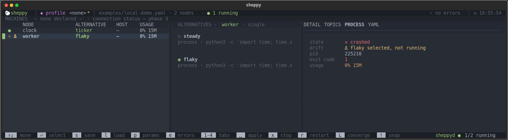

# TUI

```bash
sheppy path/to/sheppy-manifest.yaml      # defaults to ./sheppy-manifest.yaml
```

The TUI reads the manifest once, when it opens. After editing the manifest,
quit (`q`) and open it again.

It always opens with **no profile loaded**: the header reads `profile <none>`.
If `sheppyd` isn't running anything, nothing is selected either — pick
alternatives yourself, or load a [profile](../profiles) with `l`. If it is
already running nodes, from an earlier session or `sheppy up`, the TUI selects
what's running, including each node's parameter overrides, so that system
doesn't show as drift. Crashed nodes are selected too (they keep their `Δ`,
and `space` relaunches them); stopped nodes and nodes from other manifests are
not. The header stays `profile <none>` with no `*`, so press `s` if you want
to keep that selection as a profile.

## The screen



This is the [Getting started](../getting-started) demo with `clock` running
and `worker` crashed, with the PROCESS tab open.

- **Header:** the loaded profile (`<none>` until you load or save one; `*`
  means unsaved changes), the manifest file, how many nodes are running,
  validation errors, and the time.
- **Machines strip:** the machines the manifest declares. Sheppy doesn't
  connect to them yet.
- **Nodes (left):** one row per manifest node — its state, a `Δ` if it has
  [drifted](#drift), the selected alternative, its machine, and CPU and memory.
- **Alternatives (middle):** the highlighted node's alternatives. `◉` marks
  the selected one; a node can also have none selected.
- **Detail (right):** DETAIL shows the alternative's settings, TOPICS its
  declared `publishes`/`subscribes`, PROCESS its live state and last output,
  and YAML the raw manifest entry.
- **Footer:** key hints, and whether `sheppyd` is running. On a narrow
  terminal the hints are cut off from the right; the `sheppyd` status stays.

The layout needs a terminal about 100 columns wide; below that the detail
pane is squeezed first.

## Node states

| Glyph | State | Meaning |
|:-----:|-------|---------|
| `○` | stopped | not running: never started, or stopped cleanly |
| `◐` | launching | started, and still inside the launch grace period (2 s by default) |
| `●` | running | alive past the launch grace period |
| `◑` | stopping | a stop was requested; sheppy is escalating signals |
| `✕` | crashed | exited on its own; the exit code is on the PROCESS tab |
| `?` | unknown | `sheppyd` isn't running, so sheppy can't tell |

Sheppy never restarts a crashed node by itself.

## Drift

A `Δ` means what's running differs from what's selected (see
[desired vs actual](../concepts#desired-vs-actual)). The PROCESS tab adds a
`drift` line saying why:

| `drift` line | Meaning |
|--------------|---------|
| `Δ <alt> selected, not running` | the selected alternative isn't running: never launched, stopped, or crashed |
| `Δ running <alt>, nothing selected` | `sheppyd` is running the node but nothing is selected for it |
| `Δ running <alt>, selected <other>` | a different alternative is running than the one selected |
| `Δ params differ: <names>` | the running process was launched with different values for these params |
| `Δ launch command changed since start` | the selection now builds a different command than the one running, usually because the manifest was edited after launch |
| `Δ running <alt>, not in this manifest` | the running alternative is no longer listed under this node |

`space` on the node closes the gap by launching the selection.

## Keys

| Key | Action |
|-----|--------|
| `↑` / `↓` | Move through the node list, or through the alternatives once you're in them |
| `Enter` | On a node: move into its alternatives. On an alternative: select it, or de-select it if it's already selected, which leaves the node with nothing to launch |
| `Esc` | Back to the node list |
| `1`–`4` | Switch detail tab: DETAIL, TOPICS, PROCESS, YAML |
| `space` | Apply the selection to the highlighted node: launch the selected alternative, restarting the node if it's already running, or stop the node if nothing is selected |
| `x` | Stop the highlighted node |
| `r` | Restart the highlighted node with the command it was launched with. To apply a param edit, use `space` |
| `Shift+L` | Apply the whole selection: shows a plan of starts, restarts, and stops, then asks to confirm. Nodes from other manifests are left alone, and so is a selected node whose launcher fails to resolve (the failure shows under `e`) |
| `Shift+X` | Stop everything `sheppyd` is running, including nodes from other manifests (asks to confirm) |
| `!` | Copy running: set the selection to what's running. Press `s` to save it |
| `s` | Save the selection and param overrides as a [profile](../profiles) |
| `l` | Load a profile (`Enter` loads, `d` deletes) |
| `p` | Edit the highlighted node's params — the ones its selected alternative lists in the manifest |
| `e` | Show or hide the error overlay: manifest errors and launch warnings |
| `q` or `Ctrl+Q` | Quit. Running nodes keep running |

## Orphans

If `sheppyd` is running nodes that aren't in the manifest you opened — started
from another manifest, say — they appear under a `─ not in this manifest ─`
divider. You can stop one with `x` and read its logs, but `space`, `r`, and
`p` don't apply, and `Shift+L` leaves them alone. `Shift+X` and `sheppy down`
stop them along with everything else.

## Errors

A manifest with errors in some entries still opens: the errors are listed in
the overlay (`e`) and the rest stays browsable. An alternative with errors
can be selected but not launched: `space` and `Shift+L` refuse it, leave the
node as it is, and put the error in the overlay. If the file is missing or
isn't valid YAML, `sheppy` prints the error and exits instead. The same holds for profiles: a corrupt
profile file or one that has drifted from the manifest surfaces warnings in the
overlay and the applicable remainder still loads.

## Colors washed out over SSH?

Sheppy's palette needs 24-bit color. The decision is made on the machine
*running* sheppy: with `COLORTERM` unset (SSH does not forward it by default)
and `TERM=xterm-256color`, Textual quantizes every color to the 256-color
palette and the background shading is lost. On the remote machine:

```bash
export COLORTERM=truecolor   # add to your remote ~/.bashrc / ~/.zshrc
```

(or forward it: `SendEnv COLORTERM` in your local `~/.ssh/config` plus
`AcceptEnv COLORTERM` in the server's `sshd_config`). If you use tmux on the
remote, also add `set -as terminal-overrides ',*:Tc'` to `~/.tmux.conf`.
